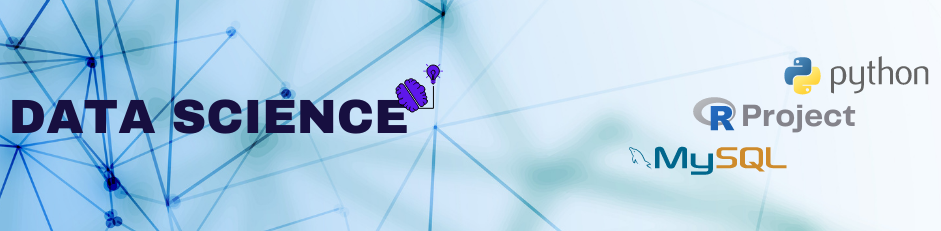

The main objective of this data science personal project portfolio is to demonstrate my skills in solving business challenges through my knowledge and tools of Data Science

  

<h1 align="center">Hi 👋, I'm Sivaramakrishnan</h1>
<h3 align="center">Data Science Enthusiast</h3>

  

  

## 👨🏻‍💻 About Me:

- 🌱 I’m currently learning **Big Data**

- 💬 Ask me about **ML,DL,Python,SQL,R**

- 👨‍💻 Life Hack: Learn new tech :fire: and share what you have learned :tada:

- ⚡ Fun fact **I am Funny**

<h3 align="left">Connect with me:</h3>

<a href="mailto:sivasrk002@gmail.com" target="blank">
   &nbsp; &nbsp;
 </a>

## 🛠️ Technologies and Tools I use:

                   

 

 
## 📊 My GitHub Data:
  

&nbsp;

  
  
   

<h3 align="center">

Publicly Available Projects

& Contributions
</h3>
<h3 align="center">

 │                       
</h3>
<h3 align="center">

 │                     
</h3>
<h3 align="center">

 │                       
</h3>
<h3 align="center">

 │                       
</h3>
<h3 align="center">

 │                    
</h3>
<h3 align="center">

 ▽                   
</h3>
